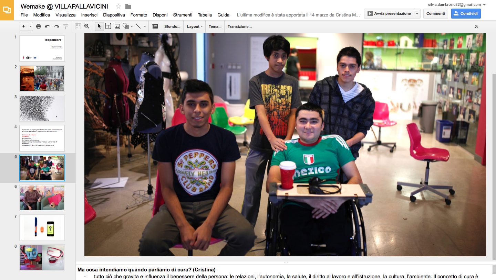
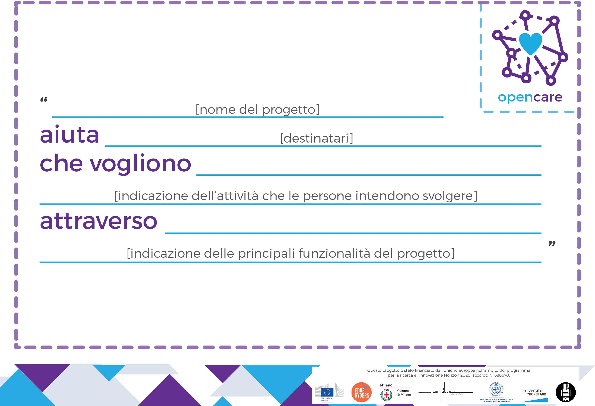

# Be clear and complete about the project/meeting/outcomes

CLARITY - OPEN TRANSPARENCY

#### **// Description**

During each phase of a collaborative design experience, from the first [Inspiration](our_experience_in_co-design_field.md#inspiration-phase) to the last [Recognition Phase](our_experience_in_co-design_field.md#recognition-phase), you may have the possibility to meet and talk to many people with difference in age, expertise, needs and passions. Probably at the first time, they might be not very interested in what you are going to propose and offer to them, just because **they don't feel properly at ease** with such a kind of topic, especially if it is strictly related with **personal arguments** or it is **too far** from their everyday life.

As explained in the previous tips, there are many subtle strategies for making people feel more aware and comfortable about a specific project and/or discussion, by means of informing them through default newsletter and quick blog posts. 

###### *(See [Keep the interest alive](keep_the_interest_alive.md) tip for more insights)* 

But when you are face to face with a **diverse audience** you might need a **presentation support**. It can be structured through different forms, the most common ones are the **slide** presentation and explanatory **videos**. Both of them can be very useful during a meeting, workshops or other kind of events. Often, they are used in the **first part of the meeting**, during which the staff are going to present *who they are*, *what is the project*, *why they are there* and *what they are going to do* with the guests/participants.

It is crucial to **adapt the tone of voice** and the **presentation style** according to the kind of audience.

###### *(See [Pay attention to the context](pay_attention_to_the_context.md))*

In any case, you have to try to **not be too dispersive** and **repetitive**, the presentation support should be designed for **catching the attention** and **provoking** audiance **participation** and **interest**. 

You have to be as clearer as possibile, from the beginning to the end of the speech. So, try to make a **list of contents** following the **Ws**. Put some **inspiring pictures** and **keywords** in order to make a funcional visual aid. Be aware, don't insert too much text, otherwise the guests/participants might get bored or they can loose the thread of the conversation. Set a **specific speech time** for each topic and exercise yourself in advance. Futhermore, divide the topics among **different speakers**. 

Lastly, give the audience the possibility to **ask questions** and explain freely their doubts. Be ready to **answer** without lose the focus and the aim of the meeting. Keep in mind the **pre-established Q&A time**, giving covertly a look to a timer is a perfect way.

#### **// In other words**

* Prepare a **list of contents** for the presentation support

* **Adapt the contents** according to the type of audience and situation (Is it a meeting? a workshop?)

* **Make the presentation** support (slide and/or video) interesting, engaging, **comprehensible** and **inclusive**

* **Don't use too much text** into the visual presentation
* Set a specific **speech time**

* Divide the topics among **different speakers**

* Go through the **Ws**: who are the actors, what they are going to do, why and how

* Be ready to the pre-established **Q&A time**

#### **// opencare experience**

In the following picture, you can see one slide of one our presetation for an **engaging meeting**. During which, we explained what is **opencare** project and how it is going to act. We showed mainly **inspiring pictures** and **few necessary informations**. It was quite effective, but the selection of pictures requires a bit of **sensibility** and attention. We even embed a **video**, which was on one side very useful and interesting for the audience, but on the other side a bit complicated to handle since it was in english and the audience was composed most of the time by italian, foreing and elderly people.

We always used **Google Slides** for many reasons: 

* the possibility to **edit** the presentation with others at the same time
* to get the files **instantly** while on the meeting place (be aware, it requires an **internet connection**!)
* as all the common slide applications, it gives the possibility to add hidden **notes** in each slide (it is very helpful to not lose the thread of the conversation)

In this second kind of slide presentation, that we showed during the **co-design sessions**, we had a more structured **visual identity** and different informations to explain. About the first point, we set all the presentations according to the new graphic layout in order to give **continuity** to all our **artifacts**. Then, we showed and explained the participants the different steps of the sessions and all the tools that the participants were going to use during the teamwork, how and why we designed them.

###### *(See [Find the right tools](find_the_right_tools.md)  tip for more details)*