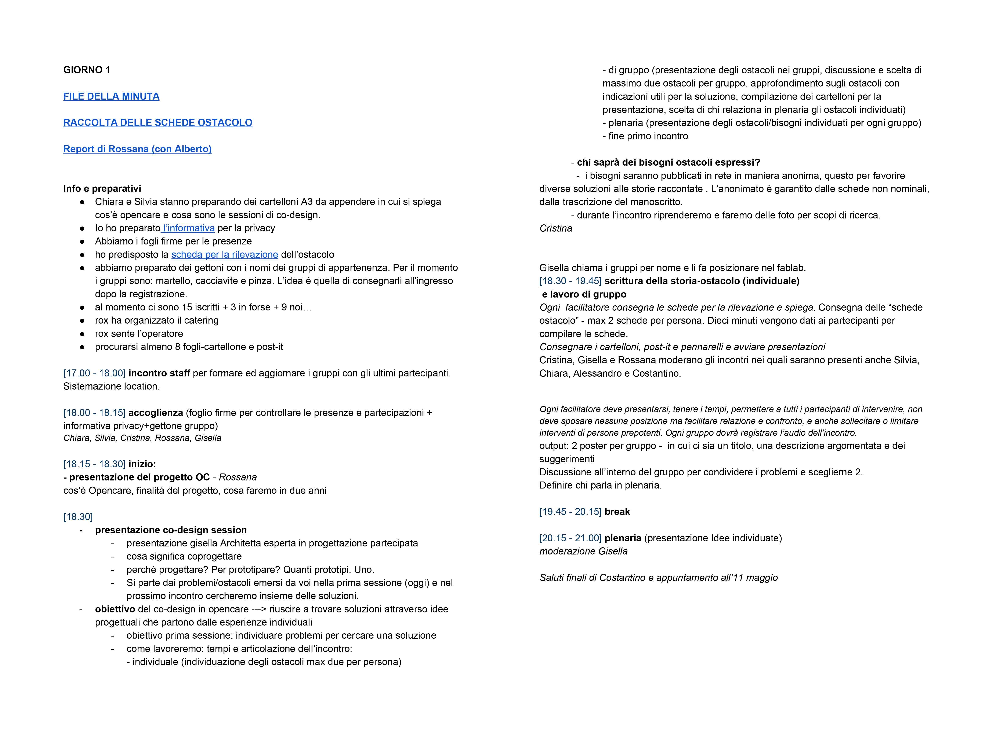

# Don’t underestimate the details

COORDINATION - DAY SCHEDULE - APPS

#### **// Description**

As you can see in the previous tips, a **coordinated team** is mandatory during each co-design phase. The team must always to be able to communicate in the easier and most effective way. Moreover, the current design approach is requiring more and more kind of collaborations between people from different cities and/or even countries, and a **tidy coordination** would be a great help. 

There are a lot of **digital applications** that enable all the team members to collaborate even in remote working. These applications are not just useful to communicate, but they are also perfect in **organizing** the *timetables*, dividing the *roles*, accomplish the *tasks*, and so on.

So, try to not be afraid about these “innovative” apps that use up your *gigabytes*, infact they are designed for helping you in not underestimate the details of an entire project. Search for the best one for you, try and test it with your project managers and then share it with the rest of the team. You should trust in these apps. But if you prefer mostly the traditional tools, we recommend you to take a piece of paper and write down the classical “**To do list**” (explaining who-when-how) in order to not forget anything. 

#### **// In other words**

* Look for **new tools** that help you in organizing your and others’ work;

* **Try and test** these apps with your project managers and then **share** them with all the team;

* Make the **communication** and the **collaboration** between all your team members easy and effective;

* Write down all the **tasks and roles** of a specific project, dividing them in a **timetable**;

* Handle and hold the team as more **coordinated** as possible.

#### **// opencare experience**

In our experience, we have tested and used a lot of applications, mainly both for smartphone and laptop. Here there is a **list of some tools** that we are still using, keep in mind that it is not a promotion work, it is just a sharing of our successes and failures: 

* **Slack**: we use it to *communicate* to each other. It is very useful because it allows us to organize  **different chat channels** according to the key sections of the main project. Within its pros, there is the fact that it is possible to create **bots**, which can send specific *notification* even from other applications. 
* **Hangout**: at the moment it is the best app to make sync and **video call**. It is especially recommended for *remote working*. It has also a chat window that allows the members to share and type *external links*. 
* **Google documents**: thanks to **Google Drive**, we are able to share and manage a huge amount of folders and file. We use **Google applications** mostly for everything, from typing a *meeting minutes* to organize a *co-design session*. Therefore we use them as parallel support of other applications. 
* **Asana**: it is very useful but at the same time it is a bit time consuming, especially at the beginning. But after a while it creates such a kind of *dependence*. It allows people to organize their own **tasks** but even to assignee some tasks to others. Surely, the strength point of this app is that everyone can see and check others’ tasks and set them according to a specific **deadline**. It has still some cons, but we are sure that Asana will be improved. 
* **EventBrite**: it is not the first time that we use EventBrite. It is very useful when you have to **organize an event** and you have to invite many people. It is a functional way to have an immediate feedback on who did the registration and who didn’t. But it is not just useful in preparing the event, it is very effective during the **check-in** too. It is a fast way to know is someone will show up in the event. 

Obviously, you have to keep in mind that most of the time not all the registered people will show up in your great event! Then you have to be prepared to extemporize. But just to not be totally lost in this situation it might be very useful, especially a co-design session, a **timing sheet** about who does what, how and when. Of course, it should be written and showed to all the staff members before any kind of event, well in advance and preferably in a relaxed way.

