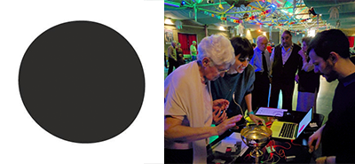
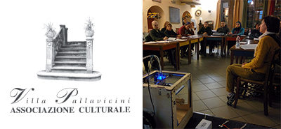
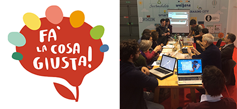
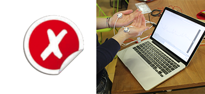
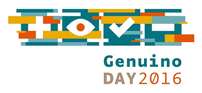
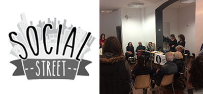

## Engagement in opencare project

Here, there is a list of all the **meetings/workshops/events** that we holded with local communities in Milan:

**1. [Mare Culturale Milano](http://maremilano.org) - March 12th, 2016** // meeting

The first public meeting of **opencare** project with a local community of **elderly people**, interested in Balera dance was a dancing evening with a singer.

**2. [Villa Pallavicini](http://www.villapallavicini.org) - March 17th, 2016** // meeting

It was a meeting with a **group of young new comers** at Villa Pallavicini. During wich they had the possibility to look over the new methodologies about digital manufacturing and to approach for the first time to the **opencare** project. 

**3. [Fa’ la Cosa Giusta](http://falacosagiusta.org) - March 18th, 2016** // workshop

The first **workshop** holded during Fa' La Cosa Giusta, a fair of critical consumption and sustainable lifestyles. The participants realized, in few hours, an opensource remote monitoring and caring IoT service.

**4. XVivaio - March 30th, 2016** // meeting

In this meeting we presented the **opencare** project to the community of **parents** of boys and girls with **special needs**. The meeting was organized at WeMake thanks to the collaboration with the Municipality of Milan.

**5. [Genuino Day](https://day.arduino.cc/#/) - April 2nd, 2016** // event

Introduction of the **opencare** project, and its state-of-the-art, during the **Genuino Day** event. Genuino Day is an anniversary event of the most famous Italian open source platform in the world. The aim was to engage makers.

**6. [Forum delle Politiche Sociali](https://www.comune.milano.it/wps/portal/ist/st/Pagine_Giovani/pagine_giovani) - April 7th, 2016 ** // workshop

Our **second workshop** organized by WeMake and the Municipality of Milan at Forum delle Politiche Sociali. During this workshop, the participants were divided in 4 different two-people groups. They were asked to idealize and **prototype**, in just few hours, an opensource remote monitoring and caring IoT service.

**7. [Social Street](http://www.socialstreet.it/social-street/milano/) San Gottardo - April 19th, 2016  ** // meeting

Last but not least, we had a meeting with the community named Social Street San Gottardo, a community of **citizens** who decided to live the neighborhood by re-activating and improving the social relationships towards a better liveability through exchange initiatives, entertainment and education. 

