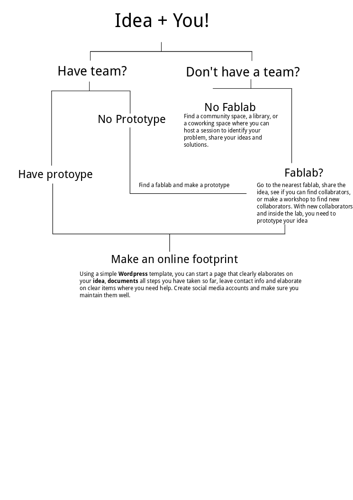

## How to engage people?

Reaching out is the first step towards engaging people. However, you need to analyze your audience's different needs, in order to ensure that people will actually continue to be involved in your project.

1. **Make it clear where help is needed** if you need tech support, make it clear that your project is planning a next phase and collaborators are welcome. If you need replicators or testers, make it clear that you are here to help them throughout replication process.
2. **Acknowledge**  Acknowledge all support that your receive.  Post and share all replicators' work. Thank people publicly and regularly. Not only does it bring good Karma, but it helps people stay engaged with your project.
3. **Invest in relations** Dedicate time to follow up with replicators, past workshop attendees. Stay connected with your grassroot community.  Over them components for free if you can afford it.

#### // A visual flow of a project time-line and options on how to start

