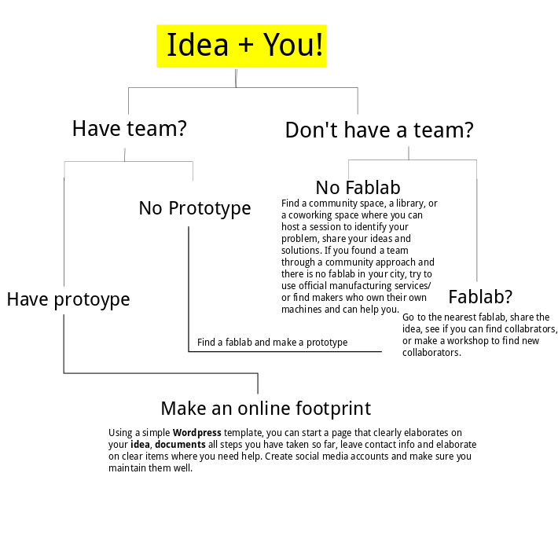

# How to involve an online community?
*Why build an online community? Where to target community and how to engage people in your project.*

## Why an online community?
There is a number of reasons why you would want to consider having an online community for your project, mainly because it allows room for different experiences, and levels of tech expertise to be involved in your project. The level of involvement of your online community depends on the stage of your project. An established project with existing team, that seeks replicators, would need a different strategy from a starting project that is seeking team members. In the scenario below, we assume that you have a very small team on the ground and that the project is at a very early stage of development.

### Where to target?

Building an online project footprint (have a reference about your project online) is your step one to reach out to your online audience.  You can choose a combination of the below options:
1. A simple **landing pag**e with About and team sections.  Where you elaborate on why you are building your project, what problem are you solving, and what resources do you need.
2. An account on one of the **documentation platforms**. Depending on familiarity and level of comfort, this could be an instrucatbels page or a github manual.
3. **Social media** accounts. If you have already kicked off some activities on the ground, even if a simple meeting, the you need to announce and document those on your FB and Twitter handle

Once you have one or more of the above established, you need to focus on:
1. **Finding your online friends**.  Here we don't mean finding people whom you know, but finding accounts for projects that are aligned with your efforts, target them and ask them to re-tweet, share, collaborate, etc.  When you find a like-minded, make sure you reach out to their audience.
2. **Design your messaging.** Make sure your align your messaging with the stage of your project.  An early stage requires different messaging from messaging after 3 month of running your projects, for example.
3. ** Build your network: **Reach out individually to people who have liked to shared your project
3.

### How to target?
Now assuming that you have already built one of more of the online foot prints above. You need to focus on your messaging.  Some hints on this:
1. Make sure you highlight the** WHY **of your project
2. **Tell your full story**: Make sure you emphasis the different sides of activities that your project has.  For example, don't put all your focus on the technology side, or the social side. Make sure you tell the full story. You want a developer looking for gig to knock your door, as much as you need a hobbyist who wants to become a beta tester.
3. **Don't waste your time**.  If a strategy isn't working and you aren't getting followers and there are no signs of growth after 2 weeks, then, change your strategy immediately. 
4. **Be responsive**. Very responsive to comments inquiries, etc.  
5. **Document**. Have documentation for whatever stage you are in at your project. You don't have to finish your project to document. You documentation starts on day one.

#### Define your audience:

It should be clear in your mind who are your audience. Which people are you trying to reach to, and at which stage? If you are seeking beta testers, then design your simple outreach online strategy to help you find them. If you need tech collaborators, then you need to think of a different strategy:
1. **Language.**  Ask yourself which languages you need to keep your communication in order to help you reach to your audience. If your local language isn't English, and you need online audience to join your next workshop, on the ground. Simple, don't write in English :). If you need a broad audience that can help replicate and tinker your project, then keep your outreach in as many languages as you can.
2. **Clear messaging**. Your are building an online community because you need people to backup your project on kickstarter? Or because you are building a networked opensource project? Or because you need to build a team?  Align your messaging to achieve your target.
3. **Where is your audience?** Social media works well for general outreach. But if you need Arduino tinkerers to know about your project, then maybe you need to drop a line at the Arduino forum, for example.
  
Now that you have reach out, how to keep the audience engaged?

## How to engage people?

Reaching out is the first step towards engaging people. However, you need to analyze your audience's different needs, in order to ensure that people will actually continue to be involved in your project.
1. **Make it clear where help is needed** if you need tech support, make it clear that your project is planning a next phase and collaborators are welcome. If you need replicators or testers, make it clear that you are here to help them throughout replication process
2. **Acknowledge**  Acknowledge all support that your receive.  Post and share all replicators' work. Thank people publicly and regularly. Not only does it bring good Karma, but it helps people stay engaged with your project.
3. **Invest in relations** Dedicate time to follow up with replicators, past workshop attendees. Stay connected with your grassroot community.  Over them components for free if you can afford it.

## A visual flow of a project timeline and options on how to start

