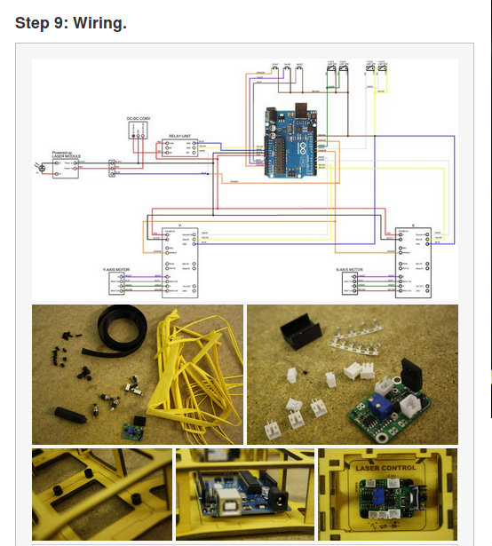

# How can I share a project? 
Moushira & Alessandro

## 

## Why document?
Honestly, documentation isn't an easy task. Once you are focused on the job you are doing and the tinkering it sometimes becomes a burden that you have to worry about making documents of how stuff has developed and how things work, but documentation isn'ta burden, it is a real treasure, and here is why:
1. The clearer your documentation, the more engaged online community you can grow
2. The more you document, the more you tell the story of your product, which is a great asset for media coverage, supporters, and again, your online community
3. Documentation helps you (yes, you!) keep track of your thoughts, how and where you have started and how you end now.
4. If you can't present it, then something is wrong. Being able to organize your thougts and guide your community through replicating how following your project is a skill that you have to master in order for your project to survive.

## Real time
Your documentation starts from day one of your project.  You need to document your activity to help you build and engage your community, and you need to document the process of thinking and developing your project.  As far as activities are concerned here are some helpful tips:
1. Take **pictures** of your event (but check if your attendees are OK with it)
2. Keep your pics of **low resolutio**n (unless you need high resolution) so that you save time converting them for online usage afterwards. 
3. **Videos** are great if possible.  You can also make a video of your pics if video editing is a hassle.
4.Keep things **short, but continuous**. You don't have to write the most elaborate blog, but it is great to blog something after every event and in planning

Documenting your actual project depends on the nature of the project.  Do you have a hardware prototype? It is a social initiate? A platform?  In any case, make sure you have the following:
1. **Language**.  Make a clear  and early decision of your language. If you are running a local initiative, there is no need to document in English unless it is your first language.
2. If your project is opensource, it is helpful to document your **early trials**, and even things that didn't go wrong. Use diagrams to help explain your decisions.
3. **Keep things visual**, when possible, add diagrams and drawings to your tutorials
4. **Talk to newbies** don't assume every reader knows about hacking.  Make things super simple, introduce every concept and technology and add references to read more about it.

## Tool to use:

There is a variety of tools and platforms that you can depend on, in order to document your projects.  Here is a sample of a few:

1. https://wordpress.com.  A simple blogging tool that has free template which can help you create an initial landing page for your project.  You can easily install it on your server through your domain provider. You can link your blog to your social media accounts where you post images and videos about meetings and progress.
2. http://www.instructables.com.  An open community of people who make things.  You can find projects shared by others and an easy way to document your project step by step.
3. http://hackaday.com another place that can host your tutorials and work on progress.  It is good to use different online documentation platforms as it helps you grow your online community base.
4. https://forum.arduino.cc/ If you are Arduino base, make sure you drop a line about your project in the Arduino form.  Something along the lines of "Hey, I am currently building this" or ask for help or simple ask for feedback.
### Examples of documented projects:

Below are samples of hardware opensource community oriented projects that share a ver detailed documentation, making it easy for others to replicate their ideas, join their efforts, or at least engage and understand what are they building:

####Microslicer
So, Microslicer is a very small laser cutter, that is fully opensource. It is developed by one person, who shared his experience in details in an [instructabels post](http://www.instructables.com/id/The-MicroSlice-V2-Aurum-A-gold-mini-laser-cutter-e/):

1. First, the initial lead part of the post, makes it clear, in a glance what this project is about

2. The Bill of materials is very detailed and supported by images and links to where to buy from.

3. Details.  Everything is super detailed, even a tiny detail such as how to color your parts without making a mess.

4. Details are important, and things could get tricky if you are explaining something like circuity and you want to make it newbie friendly.  
5. 
Well, the target of documentation here is not to give an intro to electricity. When you document your hardware project, the target is to make things as clear and as legible as possible for other to follow the logic and become able to replicate it. Use images and easy plug and play techniques, AND, use advanced schematic wiring, for those who are able to dig more.

#### Piccola
Piccola is a tiny wonderful bot that can be used as a drawing bot.  It is made entirely of laser cut parts joined together. The parts are small and it has lots of details, but the clear and detailed documentation makes it easy for other to follow and copy the project.  Lets start by where documentation resides and how it works:

1. The entire website is based on git.

#### Rishalaser
Rishalaser is an opensource laser cutter that works via mobile.  Their website is hosted on a wordpress template, and they use a mediawiki plug in, for their documentation page.  Their documentation is mostly viusal, with a plug and play style

#### Ultimaker?
Well, even complex project that have now gone commercial do have a clear and detailed documentation of their opensource 

1. 

- blog posts
- social networks
- pics
## Asynchronous
- tutorial (which online service?)
- micro website

